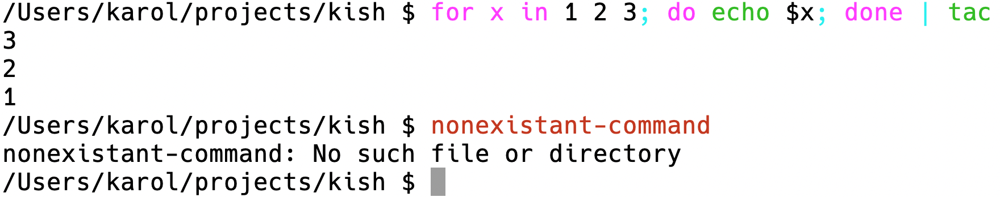
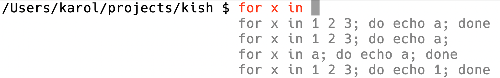

# `kish` - a simple shell, aspiring to be fully POSIX-compatibile in the future

| Syntax highlighting                                            | Interactive history                                                       |
|----------------------------------------------------------------|---------------------------------------------------------------------------|
|  |  |


## What currently works:
- simple commands
- quoting
- redirections (`> file`)
- piping (`command1 | command2`)
- conditional execution: `&&` and `||`
- compound commands (`{ command1; command2 } | command3`)
- builitins:
  - `true`
  - `false`
  - `cd` (without `-P` and `-L`)
  - `source`
- if statements: `if <command-list>; then <command-list>; [else <command-list>]; fi`
- `while` and `until` loops
- `for` loops
- piping and redirecting to/from bulitins/command lists/if statements
- user defined variables
- special variables:
  - return value from last command - `$?`
  - current pid - `$$`
- inline environment variables (`HOME='/' command`)
- `$()` command substitution
- basic interactive syntax highlighting
- history saved in `~/.kish_history`
- interactive history lookup ala fish (but with up to 4 simultaneous search results)
- loading `~/.kishrc`

## Building

The `kish` shell depends on [tcbrindle/span](https://github.com/tcbrindle/span) and [AmokHuginnsson/replxx](https://github.com/AmokHuginnsson/replxx). Those dependencies can be pulled from git submodules:

```sh
$ git submodule update --init
```

```sh
$ cmake .
$ make
```


## Testing

The `kish` shell can be tested by a shell script located in `test/tests.sh`.
Simply run the shellscript with a path to built `kish` as its argument.
